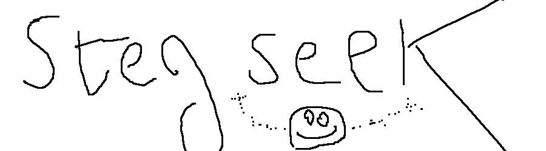

# StegSiik
> Steganography.



As expected, the title was a hint, we should use "stegseek"
``` 
stegseek --crack bad.jpg ./rockyou.txt 

StegSeek 0.6 - https://github.com/RickdeJager/StegSeek

[i] Found passphrase: "toto0845911096"    
[i] Original filename: "flag.txt".
[i] Extracting to "bad.jpg.out".

``` 
We got the file extracted 
```
cat bad.jpg.out
```
## Flag:

> alphaCTF{https://www.youtube.com/watch?v=L1RvK1443Yw&t=39s}

Which is a link to an useful Steganography video