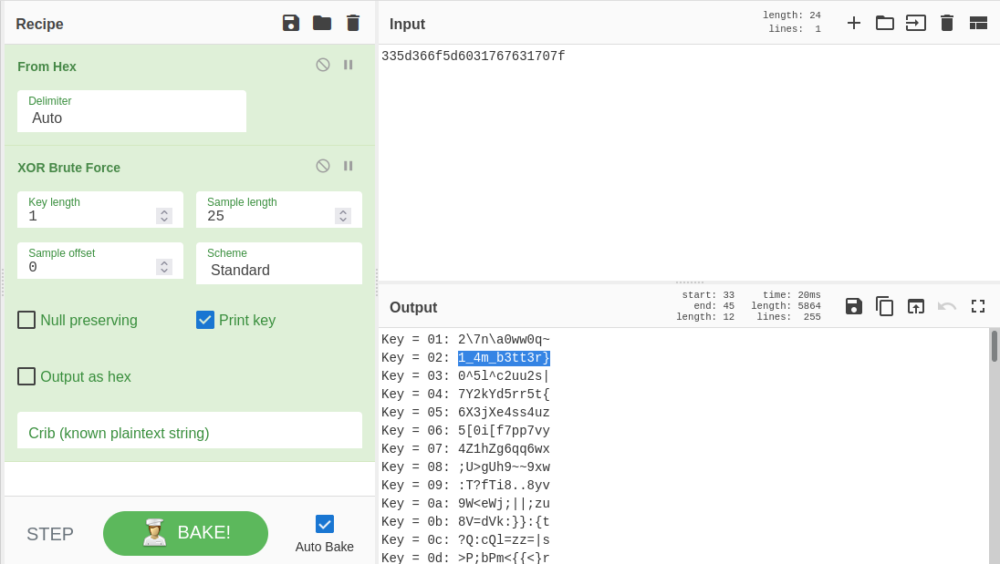

# Lab 0 - Never Too Late Mister

## *Challenge Description:*
- [MemLabs repo: Lab 0](https://github.com/stuxnet999/MemLabs/tree/master/Lab%200)
- [Image Link](https://drive.google.com/file/d/1MjMGRiPzweCOdikO3DTaVfbdBK5kyynT/view)
- Tool: Volatility Framework 2.6.1
- [Volatility cheat sheet](https://downloads.volatilityfoundation.org/releases/2.4/CheatSheet_v2.4.pdf)
## *Solution:*
1. We check image information:
    ```
    vol.py -f Challenge.raw imageinfo
        ...
        Suggested Profile(s) : Win7SP1x86_23418, Win7SP0x86, Win7SP1x86_24000, Win7SP1x86
        ...
    ```

2. We check the list of processes:
    ```
    vol.py -f Challenge.raw --profile=Win7SP1x86_23418 pstree
        ...
        0x85097870:explore.exe
        0x845a8d20:DumpIt.exe
        0x851a6610:cmd.exe
        ...
    ```

3. Since cmd.exe were running, we check which commands were executed:
    ```
    vol.py -f Challenge.raw --profile=Win7SP1x86_23418 cmdscan
        ...
        Cmd #0 @ 0x2f43c0: C:\Python27\python.exe C:\Users\hello\Desktop\demon.py.txt
        ...
    ```

4.  That was a python script, did is send anything to stdout?
    ```
    vol.py -f Challenge.raw --profile=Win7SP1x86_23418 consoles
        ...
        C:\Users\hello>C:\Python27\python.exe C:\Users\hello\Desktop\demon.py.txt
        335d366f5d6031767631707f
        ...
    ```
5.  The string might be encrypted
   

6.  It was only a part of the flag. Time for looking for some hints. In the description, it was mentioned that *John is an "environmental*. What about environment variables?
```
    vol.py -f Challenge.raw --profile=Win7SP1x86_23418 envars
        ...
        2424 conhost.exe          0x002934b0 Thanos                         xor and password
        ...
```
7.  The variable Thanos is another hint that the second part of the flag is the user password
```
    vol.py -f Challenge.raw --profile=Win7SP1x86_23418 hashdump
        Administrator:500:aad3b435b51404eeaad3b435b51404ee:31d6cfe0d16ae931b73c59d7e0c089c0:::
        Guest:501:aad3b435b51404eeaad3b435b51404ee:31d6cfe0d16ae931b73c59d7e0c089c0:::
        hello:1000:aad3b435b51404eeaad3b435b51404ee:101da33f44e92c27835e64322d72e8b7:::
```
8. Let's try to get user's password   
    `echo '101da33f44e92c27835e64322d72e8b7' > hello.hash`

    `john --format=nt hello.hash`

## *FLAG:*
flag{you_are_good_but1_4m_b3tt3r}


