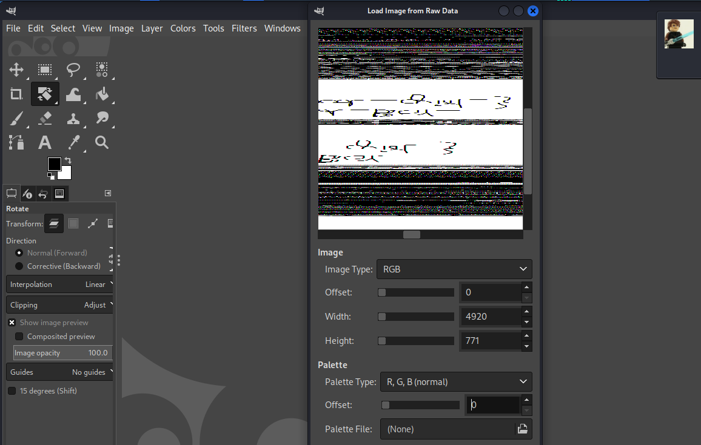

# Lab 1 - Beginner's Luck 

## *Challenge Description:*
- [MemLabs repo: Lab 1](https://github.com/stuxnet999/MemLabs/tree/master/Lab%201)
- [Image Link](https://mega.nz/#!6l4BhKIb!l8ATZoliB_ULlvlkESwkPiXAETJEF7p91Gf9CWuQI70)
- Tool: Volatility Framework 2.6.1
- [Volatility cheat sheet](https://downloads.volatilityfoundation.org/releases/2.4/CheatSheet_v2.4.pdf)
## *Solution:*
1. We check image information:
    ```
    vol.py -f MemoryDump_Lab1.raw imageinfo
        ...
        Suggested Profile(s) : Win7SP1x64, Win7SP0x64, ...
        ...
    ```

2. We check the list of processes:
    ```
    vol.py -f MemoryDump_Lab1.raw --profile=Win7SP1x64 pslist
        ...
        0xfffffa8002222780 cmd.exe
        0xfffffa80022bab30 mspaint.exe 
        0xfffffa8001010b30 WinRAR.exe
        0xfffffa8000f4c670 explorer.exe 
        ...
    ```

3. Since cmd.exe were running, we check which commands were executed:
    ```
    vol.py -f Challenge.raw --profile=Win7SP1x64 cmdscan
        ...
        Cmd #0 @ 0x1de3c0: St4G3$1
        ...
    ```

4.  Seems like it contains first stage flag.
    ```
    vol.py -f Challenge.raw --profile=Win7SP1x64 consoles
        ...
        C:\Users\SmartNet>St4G3$1                       ZmxhZ3t0aDFzXzFzX3RoM18xc3Rfc3Q0ZzMhIX0=
        ...
    ```
5.  Indeed It was the first flag Base64 encrypted.
## *Flag 01:*
flag{th1s_1s_th3_1st_st4g3!!

6. The next process was mspaint.exe, what if we dump it.  
```
    vol.py -f MemoryDump_Lab1.raw --profile=Win7SP1x64 memdump -p 2424 -D .
        ...
        Writing mspaint.exe [  2424] to 2424.dmp
        ...
```
7.  Getting back to the description, "When the crash happened, she was trying to draw something." the dump file must have the last non-saved paint. I opened it with GIMP but first I changed the extension to "2424.data". And after a long struggle trying to change width and height, the flag appears there

## *Flag 02:*
flag{G00d_BoY_good_girL}

8. Since Winrar.exe was running too, We should be looking for a ".rar" file   
```
    vol.py -f MemoryDump_Lab1.raw --profile=Win7SP1x64 filescan | grep ".rar"
        ...
        0x000000003fac3bc0      1      0 R--r-- \Device\HarddiskVolume2\Users\Alissa Simpson\Documents\Important.rar
        ...
```
9. I tried to dump then unrar it, I got:
```
    vol.py -f MemoryDump_Lab1.raw --profile=Win7SP1x64 dumpfiles -Q 0x000000003fac3bc0 -D .
```
```
    mv file.None.0xfffffa8001034450.dat Important.rar 
```
```
    unrar e Important.rar
        ...
        Password is NTLM hash(in uppercase) of Alissa's account passwd.
        Enter password (will not be echoed) for flag3.png: 
```
10. Looked for Alissa's password:
 ```
    vol.py -f MemoryDump_Lab1.raw --profile=Win7SP1x64 hashdump
        ...
        Alissa Simpson:1003:aad3b435b51404eeaad3b435b51404ee:f4ff64c8baac57d22f22edc681055ba6:::
        ...
 ``` 
 11. Extracting flag3.png


## *FLAG3:*
flag{w3ll_3rd_stage_was_easy}


