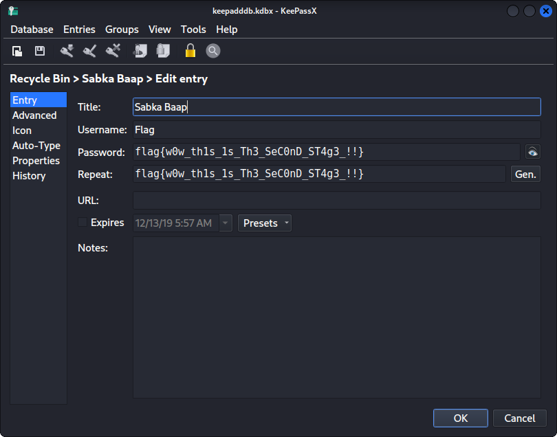

# Lab 2 - A New World
## *Challenge Description:*
- [MemLabs repo: Lab 2](https://github.com/stuxnet999/MemLabs/tree/master/Lab%202)
- [Image Link](https://mega.nz/#!ChoDHaja!1XvuQd49c7-7kgJvPXIEAst-NXi8L3ggwienE1uoZTk)
- Tool: Volatility Framework 2.6.1
- [Volatility cheat sheet](https://downloads.volatilityfoundation.org/releases/2.4/CheatSheet_v2.4.pdf)
## *Solution:*
1. We check image information:
```
    vol.py -f MemoryDump_Lab2.raw imageinfo
        ...
        Suggested Profile(s) : Win7SP1x64, Win7SP0x64,...
        ...
```

2. We check the list of processes:
```
    vol.py -f MemoryDump_Lab2.raw --profile=Win7SP1x64 pslist
        ...
        0xfffffa8002131340 explorer.exe 
        0xfffffa80022e5950 cmd.exe 
        0xfffffa8002109b30 chrome.exe
        0xfffffa800224a8c0 KeePass.exe
        0xfffffa80011956a0 notepad.exe
        ...
```

3. Since cmd.exe were running, we check which commands were executed:
```
    vol.py -f MemoryDump_Lab2.raw --profile=Win7SP1x64 cmdscan
        ...
        Cmd #0 @ 0x3db330: Nothing here kids :)
        ...
```

1.  Well, That's a soft RickRoll. Back to the description ('environmental' activist). But is he a VARIABLE?
```
    vol.py -f MemoryDump_Lab2.raw --profile=Win7SP1x64 envars
        ...  
        368 csrss.exe            0x0000000000371320 NEW_TMP                             C:\Windows\ZmxhZ3t3M2xjMG0zX1QwXyRUNGczXyFfT2ZfTDRCXzJ9
        ...
```
And that's our first flag!
## *Flag 01:*
flag{w3lc0m3_T0_$T4g3_!_Of_L4B_2}

5. We check what were run in the explorer 
```
    vol.py -f MemoryDump_Lab2.raw --profile=Win7SP1x64 iehistory
        ...
        **************************************************
            Process: 1064 explorer.exe
            Cache type "URL " at 0x40a5400
            Record length: 0x100
            Location: Visited: Alissa Simpson@file:///C:/Users/Alissa%20Simpson/Pictures/Password.png
            Last modified: 2019-12-14 10:37:41 UTC+0000
            Last accessed: 2019-12-14 10:37:41 UTC+0000
            File Offset: 0x100, Data Offset: 0x0, Data Length: 0xb8
        **************************************************
            Process: 1064 explorer.exe
            Cache type "URL " at 0x40a5500
            Record length: 0x100
            Location: Visited: Alissa Simpson@file:///C:/Users/SmartNet/Secrets/Hidden.kdbx
            Last modified: 2019-12-13 14:17:05 UTC+0000
            Last accessed: 2019-12-13 14:17:05 UTC+0000
            File Offset: 0x100, Data Offset: 0x0, Data Length: 0xb0
        ...
```
6.  Seems like we're facing a password manager database and a password.
```
    vol.py -f MemoryDump_Lab2.raw --profile=Win7SP1x64 filescan | grep Pictures
        ...
        0x000000003fce1c70      1      0 R--r-d \Device\HarddiskVolume2\Users\Alissa Simpson\Pictures\Password.png
        ...

    vol.py -f MemoryDump_Lab2.raw --profile=Win7SP1x64 dumpfiles -Q 0x000000003fce1c70 -D .

    vol.py -f MemoryDump_Lab2.raw --profile=Win7SP1x64 filescan | grep Secret
        ...
        0x000000003fb112a0     16      0 R--r-- \Device\HarddiskVolume2\Users\SmartNet\Secrets\Hidden.kdbx
        ...

    vol.py -f MemoryDump_Lab2.raw --profile=Win7SP1x64 dumpfiles -Q 0x000000003fb112a0 -D .
```
7. We found out that the db password is: "P4SSw0rd_123". We try to open Hidden.kdbx with keepassX

## *Flag 02:*
flag{w0w_th1s_1s_Th3_SeC0nD_ST4g3_!!}

8. Still we didn't check chrome browser history, I used a plugin from this repo [volatility-plugins](https://github.com/superponible/volatility-plugins)  
```
    vol.py -f MemoryDump_Lab2.raw --profile=Win7SP1x64 chromehistory
        ...
         1     0 2019-12-14 10:37:11.596681        N/A       
        32 https://mega.nz/#F!TrgSQQTS!H0ZrUzF0B-ZKNM3y9E76lg                               
        ...
```
9. So we download Important.zip. When i tried to unrar it, I got
```
    unzip Important.zip
        Password is SHA1(stage-3-FLAG) from Lab-1. Password is in lowercase.
```
10. The password should be:  SHA1(flag{w3ll_3rd_stage_was_easy}) = 6045dd90029719a039fd2d2ebcca718439dd100a. Finally, we can view Important.png.


## *Flag3:*
flag{oK_So_Now_St4g3_3_is_DoNE!!}


