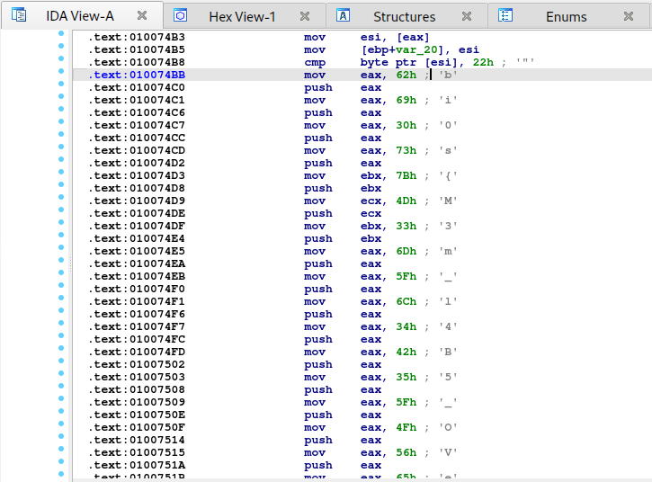

# Lab 5 - Black Tuesday
## *Challenge Description:*
- [MemLabs repo: Lab 5](https://github.com/stuxnet999/MemLabs/tree/master/Lab%205)
- "We received this memory dump from our client recently. Someone accessed his system when he was not there and he found some rather strange files being accessed. Find those files and they might be useful. I quote his exact statement,
    >The names were not readable. They were composed of alphabets and numbers but I wasn't able to make out what exactly it was.

   Also, he noticed his most loved application that he always used crashed every time he ran it. Was it a virus?"
- [Image Link](https://mega.nz/#!Ps5ViIqZ!UQtKmUuKUcqqtt6elP_9OJtnAbpwwMD7lVKN1iWGoec)
- Tools: Volatility Framework 2.6.1
- [Volatility cheat sheet](https://downloads.volatilityfoundation.org/releases/2.4/CheatSheet_v2.4.pdf)
## *Solution:*
1. General Analysis:
```
    vol.py -f MemoryDump_Lab5.raw imageinfo 
        ...
        Suggested Profile(s) : Win7SP1x64, Win7SP0x64, Win2008R2SP0x64, Win200823418
        ...
```

```
    vol.py -f MemoryDump_Lab5.raw --profile=Win7SP1x64 pslist 
        ...
        0xfffffa80010213d0 explorer.exe           1580
        0xfffffa8000f97a20 WinRAR.exe             2924
        0xfffffa80010b8060 notepad.exe            2744
        0xfffffa800108cb30 NOTEPAD.EXE            2724
        ...
```
2. Checking Explorer history:
```
    vol.py -f MemoryDump_Lab5.raw --profile=Win7SP1x64 iehistory
        ...
        Location: Visited: Alissa Simpson@file:///C:/Users/Alissa%20Simpson/Documents/Important.rar
        ...
        Location: Visited: Alissa Simpson@file:///Z:/MemLabs-Files/Lab-2/Password.png
        ...
        Location: :2019122020191221: Alissa Simpson@file:///C:/Users/Alissa%20Simpson/Pictures/ZmxhZ3shIV93M0xMX2QwbjNfU3Q0ZzMtMV8wZl9MNEJfNV9EMG4zXyEhfQ.bmp
        ...
        Location: Visited: SmartNet@file:///C:/Users/SmartNet/Desktop/St4g3$1.txt
        ...
        Location: Visited: SmartNet@file:///C:/Users/SmartNet/Desktop/st4G3$$1.txt
        ...
        Location: :2019122020191221: SmartNet@file:///C:/Users/SmartNet/Documents/SW1wb3J0YW50.rar
        ...

```
3. For now we simply look for what those strings stand for, seem to be some base64:
>ZmxhZ3shIV93M0xMX2QwbjNfU3Q0ZzMtMV8wZl9MNEJfNV9EMG4zXyEhfQ : flag{!!_w3LL_d0n3_St4g3-1_0f_L4B_5_D0n3_!!}
>SW1wb3J0YW50 : Important
## *Flag 01:*
flag{!!_w3LL_d0n3_St4g3-1_0f_L4B_5_D0n3_!!}

4.  We dump the rar file (I've demonstrated how to do so in the previous labs), we get a password protected png. The first flag is the password. We get:
## *Flag 02:*


5. Back to the description, the author mentioned an application that should be NOTEPAD.EXE. Honestly, I spend a long time checking its ".dmp" file with no effective result. So back to the hard way, I opened it with IDA:
   

## *Flag 03:*
bi0s{M3m_l4B5_OVer_!}
