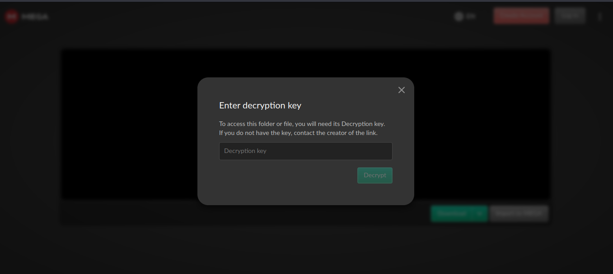
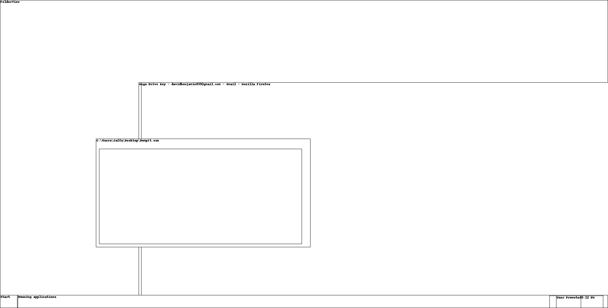
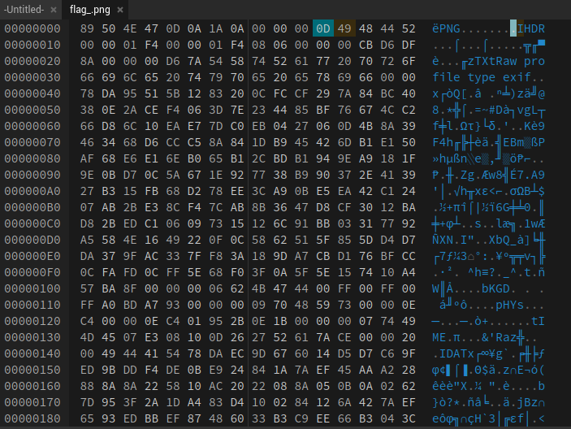
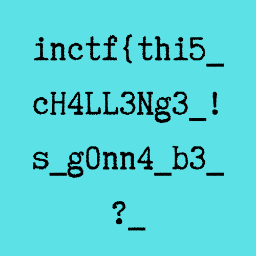

# Lab 6 - The Reckoning
## *Challenge Description:*
- [MemLabs repo: Lab 6](https://github.com/stuxnet999/MemLabs/tree/master/Lab%206)
- "We received this memory dump from the Intelligence Bureau Department. They say this evidence might hold some secrets of the underworld gangster David Benjamin. This memory dump was taken from one of his workers whom the FBI busted earlier this week. Your job is to go through the memory dump and see if you can figure something out. FBI also says that David communicated with his workers via the internet so that might be a good place to start."
- [Image Link](https://mega.nz/#!C0pjUKxI!LnedePAfsJvFgD-Uaa4-f1Tu0kl5bFDzW6Mn2Ng6pnM)
- Tools: Volatility Framework 2.6.1, OLEtools, pngcheck, Hexed.it
- [Volatility cheat sheet](https://downloads.volatilityfoundation.org/releases/2.4/CheatSheet_v2.4.pdf)
## *Solution:*
1. General Analysis:
```
    vol.py -f MemoryDump_Lab6.raw imageinfo 
        ...
        Suggested Profile(s) : Win7SP1x64, Win7SP0x64, Win2008R2SP0x64, Win2008R2SP1x64_24000
        ...
```

```
    vol.py -f MemoryDump_Lab6.raw --profile=Win7SP1x64 pslist 
        ...
        0xfffffa800319a060 explorer.exe           1944
        0xfffffa8002324b30 cmd.exe                 880
        0xfffffa800234eb30 chrome.exe             2124
        0xfffffa8003905b30 firefox.exe            2080
        0xfffffa80035e71e0 WinRAR.exe             3716
        ...
```
2. Checking Command line arguments and commands:
```
    vol.py -f MemoryDump_Lab6.raw --profile=Win7SP1x64 cmdscan
        ...
        Cmd #0 @ 0x1fd530: whoami
        Cmd #1 @ 0x1fdde0: env
        ...
```
```
    vol.py -f MemoryDump_Lab6.raw --profile=Win7SP1x64 cmdline
        ...
        Command line : "C:\Program Files\WinRAR\WinRAR.exe" "C:\Users\Jaffa\Desktop\pr0t3ct3d\flag.rar"
        ...
```
3.  Dumping the flag.rar and trying to unrar it, results a password protected png. So we should be looking for the password.
4.  What command is "env"? I guess that was a sophisticated hint to check environment variables
```
    vol.py -f MemoryDump_Lab6.raw --profile=Win7SP1x64 envars | grep WinRAR
        ...
        716 WinRAR.exe           0x00000000002a1320 RAR password                   easypeasyvirus
        ...
```
So the password is: easy peasy virus

## *Flag part 02:*


5.  Checking Explorer, chrome, and firefox history, The only interesting thing I've found is:
```
    vol.py -f MemoryDump_Lab6.raw --profile=Win7SP1x64 chromehistory
        ...
        1     0 2019-08-18 10:32:37.603074        N/A       
        169 https://pastebin.com/RSGSi1hk
        ...
```
Checking the link:
```
https://www.google.com/url?q=https://docs.google.com/document/d/1lptcksPt1l_w7Y29V4o6vkEnHToAPqiCkgNNZfS9rCk/edit?usp%3Dsharing&sa=D&source=hangouts&ust=1566208765722000&usg=AFQjCNHXd6Ck6F22MNQEsxdZo21JayPKug
 
 
But David sent the key in mail.
 
The key is... :(
```
6. No key was mentioned, I tried to download the document and check for malicious content.
```
    olevba --decode word/document.xml
        ...
        https://mega.nz/#!SrxQxYTQ
        ...
```


7. We're looking for a key again, I've tried so many things before I started looking for a hint. Thankfully the "screenshot" plugin gave this:
```
    vol.py -f MemoryDump_Lab6.raw --profile=Win7SP1x64 screenshot -D .
```


We can read:
>Mega Drive Key - davidbenjamin939@gmail.com - Gmail- Mozilla Firefox

8. The easiest way to look for aa string:
```
    strings MemoryDump_Lab6.raw | grep "Mega Drive Key"
        ...
        "THE KEY IS zyWxCjCYYSEMA-hZe552qWVXiPwa5TecODbjnsscMIU\"
        ...
```
9. Back the the mega drive, we download the png and it seems to be corrupted:
```
    pngcheck flag_.png
    flag_.png  first chunk must be IHDR
    ERROR: flag_.png
``` 
After correcting it using a Hex Editor we get the flag.


## *Flag part 01:*


## *Flag:*
inctf{thi5_cH4LL3Ng3_!s_g0nn4_b3_?_aN_Am4zINg_!_i_gU3Ss???_}
